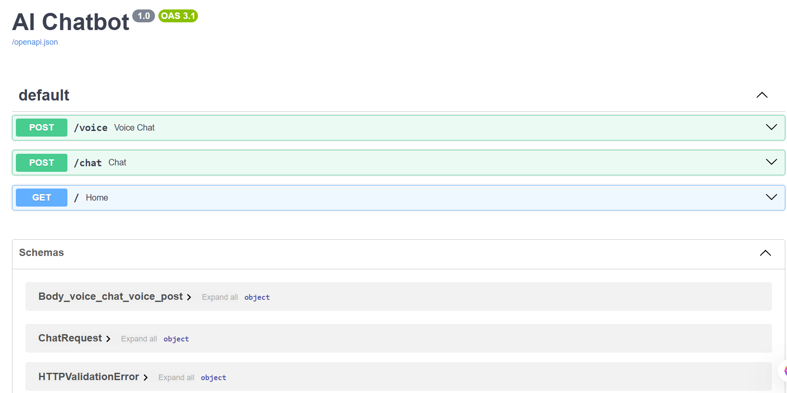
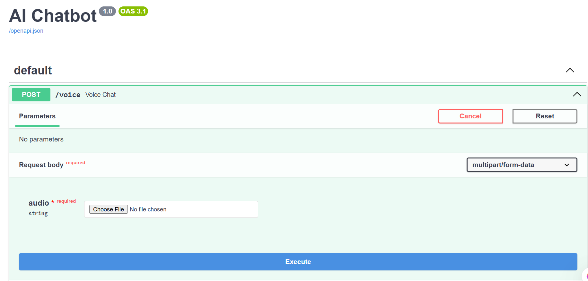
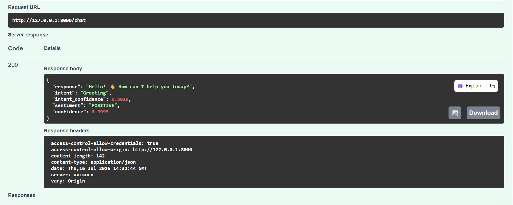
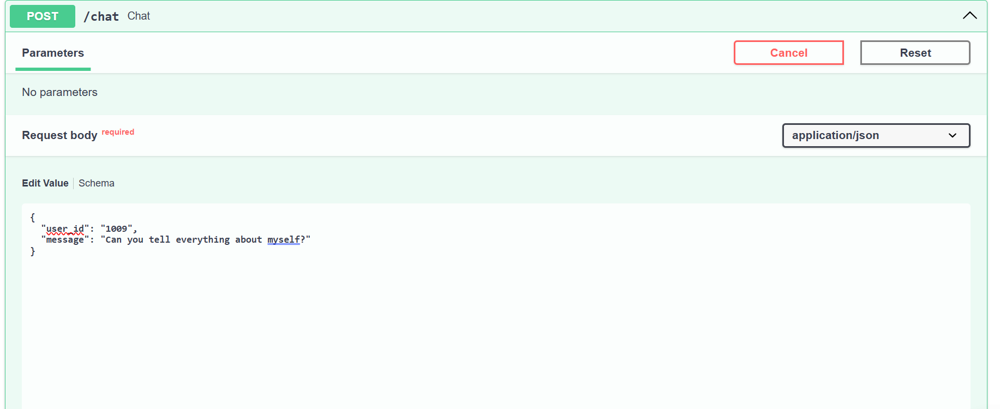
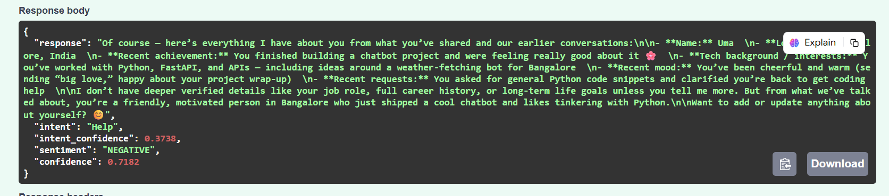
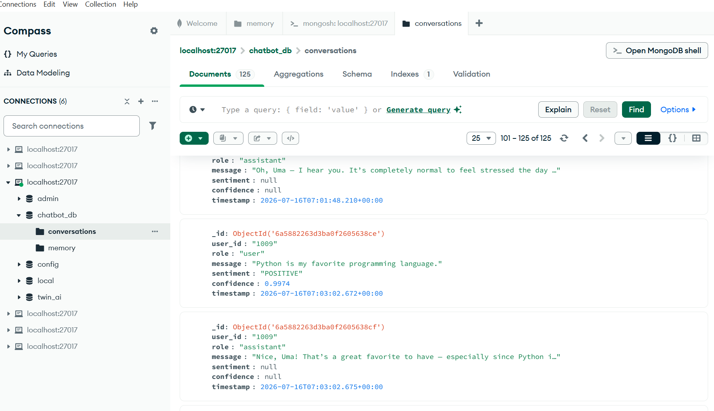
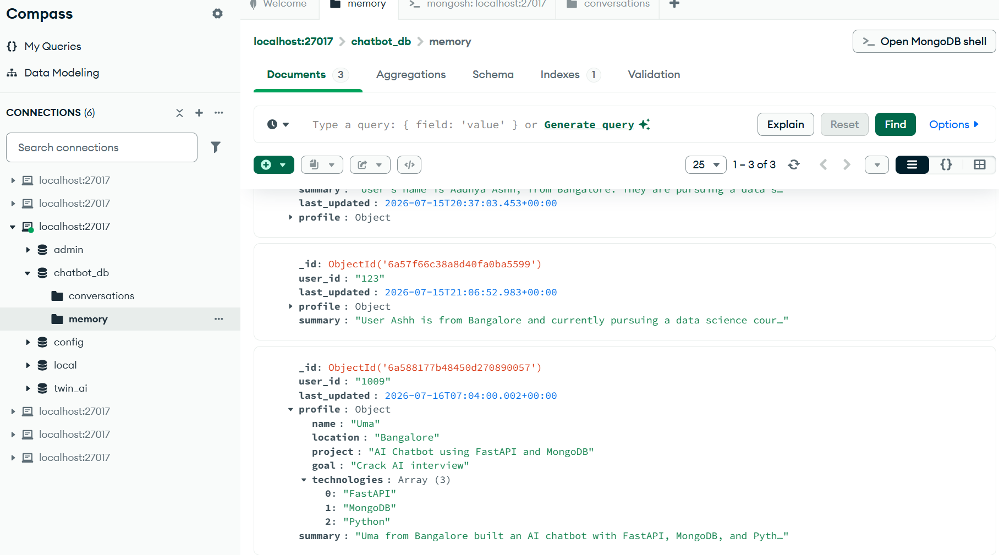
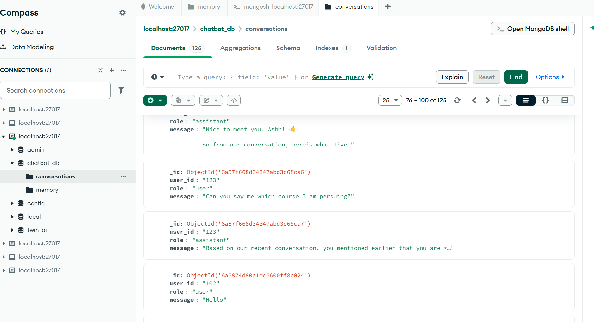

# 🤖 AI Chatbot with Memory, Sentiment Analysis, Intent Detection & Voice Support

## 📌 Project Overview

This project is an intelligent AI Chatbot developed using **FastAPI**, **MongoDB**, **Streamlit**, and **Python**. The chatbot supports natural language conversations, remembers user information across sessions, detects user sentiment and intent, and accepts both text and voice input using OpenAI Whisper.

The objective of this project is to demonstrate a modern conversational AI system that combines Natural Language Processing (NLP), Long-Term Memory, Speech Recognition, and Large Language Models into a single application.

---

# ✨ Features

### 💬 Chat Interface
- Text-based conversation
- ChatGPT-style Streamlit interface
- Conversation history

### 🧠 Long-Term Memory
- Stores user profile in MongoDB
- Remembers:
  - Name
  - Location
  - Project
  - Goal
  - Technologies
- Uses memory only for personal questions
# 🛡️ Guardrails Implemented

The chatbot includes several guardrails to improve response quality, user safety, and reliability.

### ✅ Personal Memory Protection
- Long-term memory is used **only** for personal questions.
- General knowledge questions do not access user memory.
- User profile information is retrieved only when relevant.

**Example:**
- ✔️ "What is my name?" → Uses MongoDB memory
- ✔️ "What project am I working on?" → Uses MongoDB memory
- ✔️ "Explain Python." → Does NOT use memory

---

### ✅ Hallucination Prevention
- The chatbot avoids making up personal information.
- If required information is unavailable, it responds honestly instead of generating incorrect answers.

---

### 😊 Sentiment Analysis
Detects user emotion:
- Positive
- Negative
- Neutral

Displays sentiment confidence score.

### 🎯 Intent Detection
Automatically classifies user queries into categories such as:
- General Knowledge
- Personal Memory
- Help
- Programming
- AI Interview
- Machine Learning

### 🎤 Voice Input
Supports speech-to-text using OpenAI Whisper.

Users can:
- Record voice
- Convert speech to text
- Continue chatting using voice

### 📚 Conversation Memory
Maintains:
- Recent conversation history
- Long-term user profile
- Conversation summary

### 📄 API Documentation
Interactive Swagger UI using FastAPI.

---

# 🏗️ System Architecture

```
                +-----------------------+
                |    Streamlit UI       |
                | Text + Voice Input    |
                +----------+------------+
                           |
                           |
                    HTTP Requests
                           |
                           ▼
                  +------------------+
                  |     FastAPI      |
                  +------------------+
                           |
        -----------------------------------------
        |          |          |         |        |
        ▼          ▼          ▼         ▼        ▼
   Memory     Sentiment    Intent   Whisper    LLM
   Service     Analysis   Detection Speech-to-Text
        |                               |
        |                               |
        ▼                               ▼
              MongoDB Database
```

---

# ⚙️ Tech Stack

| Technology | Purpose |
|------------|---------|
| Python | Programming Language |
| FastAPI | Backend REST APIs |
| Streamlit | Frontend UI |
| MongoDB | Database |
| OpenRouter / LLM | AI Response Generation |
| Transformers | NLP Models |
| Whisper | Speech-to-Text |
| HuggingFace | Sentiment & Intent Models |
| Uvicorn | FastAPI Server |

---

# 📂 Project Structure

```
AI_CHATBOT/
│
├── backend/
│   ├── app.py
│   ├── config.py
│   ├── database.py
|   |--.env  
│   ├── models/
│   ├── routes/
│   │      ├── chat.py
│   │      └── voice.py
│   ├── services/
│   │      ├── llm_service.py
│   │      ├── memory_service.py
│   │      ├── summary_service.py
│   │      ├── prompt_builder.py
│   │      ├── sentiment_service.py
│   │      ├── intent_service.py
│   │      └── whisper_service.py
│   └── requirements.txt
│
├── frontend/
│      └── streamlit_app.py
│
└── README.md
```

---

# 🚀 Installation

## Clone Repository

```bash
git clone <repository-url>
cd AI_CHATBOT
```

---

## Create Virtual Environment

```bash
python -m venv venv
```

Activate

Windows

```bash
venv\Scripts\activate
```

Linux/Mac

```bash
source venv/bin/activate
```

---

## Install Dependencies

```bash
pip install -r requirements.txt
```

---

## Start MongoDB

Make sure MongoDB server is running.

---

## Run FastAPI Backend

```bash
cd backend

uvicorn app:app --reload
```

Backend URL

```
http://127.0.0.1:8000
```

Swagger

```
http://127.0.0.1:8000/docs
```

---

## Run Streamlit Frontend

```bash
cd frontend

streamlit run app.py
```

---

# 📸 Screenshots

Include screenshots of:

### 🖥️ Home Screen



---

### 💬 Chat Interface


---

### 🎤 Voice Input



---

### 😊 Sentiment Detection



---

### 🎯 Intent Detection


---

### 🧠 Memory Response





---

### 🗄️ MongoDB Collections





---

# 🧪 Sample API Request

```json
POST /chat

{
  "user_id":"1009",
  "message":"Tell me about myself"
}
```

---

# Sample Response

```json
{
  "response":"Your stored profile information...",
  "intent":"Personal Memory",
  "sentiment":"Positive",
  "confidence":0.94
}
```

---

# 📊 Modules Implemented

✅ Chat API

✅ Streamlit Frontend

✅ MongoDB Integration

✅ Long-Term Memory

✅ Conversation Summary

✅ Sentiment Analysis

✅ Intent Detection

✅ Whisper Voice Recognition

✅ Swagger Documentation

---

# 🔮 Future Enhancements

- PDF Upload & RAG using ChromaDB
- Weather API Integration
- Calculator Tool
- Time API
- Text-to-Speech Response
- Multi-language Support
- Authentication & User Login
- React Frontend
- Docker Deployment
- Cloud Deployment (AWS/GCP)
- AI Agent with Tool Calling

---

# 🎯 Learning Outcomes

Through this project, the following concepts were implemented:

- REST API Development
- FastAPI Framework
- MongoDB CRUD Operations
- Large Language Model Integration
- Prompt Engineering
- Conversation Memory
- Sentiment Analysis
- Intent Detection
- Speech-to-Text
- Streamlit Dashboard Development
- AI Chatbot Architecture

---

# 👩‍💻 Author

**Ashwitha K K**

AI/ML Developer

Python | FastAPI | MongoDB | NLP | Machine Learning

---

# 📜 License

This project is developed for educational and interview demonstration purposes.